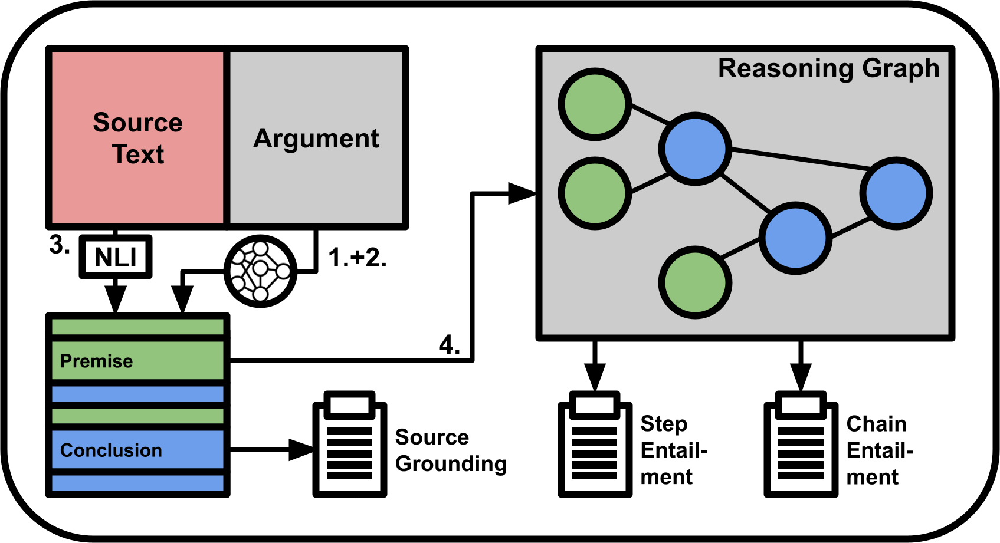

# **HRE-ToM** - **H**olistic **R**easoning **E**valuation of **T**heory **o**f **M**ind Tasks
**HRE-ToM** is a benchmark that aims to holistically evaluate the quality of reasoning chains in Theory of Mind contexts. It uses two scenario-based tasks covering two different aspects of ToM, **Inferring Emotion** and **Knowledge-Perception**, and evaluates the generated reasoning chains using a novel holistic evaluation framework: **LLogNet**. 
This repository contains:
- The scripts to synthetically create data for the two ToM tasks, Inferring Emotion and Knowledge-Perception.
- An inference scripts to generate reasoning chains to answer the tasks.
- An evaluation script to evaluate the produced reasoning chains with holistic evaluation frameworks. Next to **LLogNet**, the other framworks **ROSCOE** and **ReCEval** are available.
- An experiment to test the capabilities of the holistic evaluation frameworks, including: 
	- Correct and perturbed reasoning chains for both tasks.
	- Two Jupyter-notebook for evaluation.
- A scripts to test the performance of NLI models on non-deductive reasoning chains.
- A script to investigate biases in LLM regarding spatial and temporal reasoning.


## Setup
This repository requires multiple conda environments used for different tasks. The `environment/` directory contains the necessary `.yml` files for installing these environments. This is done to prevent dependency issues. To setup the environments follow the instructions:
- Install this environment to generate data for the benchmarks:
	```bash
	conda env create -f envs/datagen_environment.yml
	```
- Install this environment for inference and evaluation with LLogNet and ROSCO:
	```bash
	conda env create -f envs/hre_environment.yml
	```
- Install this environment for evaluation with ReCEval:
	```bash
	conda env create -f envs/receval_environment.yml
	```
**Important:** All environments above were created for CUDA 12.2. Using other CUDA versions might cause dependency issues.
- Install this environment for the statistical evaluation of the experiment:
	```bash
	conda env create -f envs/stats_environment.yml
	```

## The Theory of Mind Tasks
The benchmarks evaluates Theory of Mind reasoning abilities using two distinct tasks: **Inferring Emotion** and **Knowledge-Perception**. 
Both tasks are scenario-based, which means that the tasks provide a scenario that describes a sequence of events involving two persons. The scenario is followed with a question about the scenario. 
The datasets used in the tasks are stored in `Evaluation/data` as `JSON` and `CSV` files and  are also available on Hugging Face:
- [HRE-ToM-Inferring Emotion](https://huggingface.co/datasets/Z3R6X/HRE-ToM-InferringEmotion).
- [HRE-ToM-Knowledge-Perception](https://huggingface.co/datasets/Z3R6X/HRE-ToM-KnowledgePerception).

### Inferring Emotion
The **Inferring Emotion** task aims to evaluate the ability to infer the emotion of a person based on situational context. Each scenario describes a situation involving two persons, where one person experiences an emotion triggered by an event. This emotion can be inferred from the observable actions and the behavior of the person. 
Details:
- Objective: Infer the emotion of one person.
- Question: What emotion might `person` experience?
- Dataset Size: 56 scenarios.

### Knowledge-Perception
The Knowledge-Perception task aims to evaluate the ability to link perception to knowledge. Each scenario involves one person moving an object to a new location and another person leaving and later returning the room. The second person either observes or does not observe the other person moving the object. 
Details:
- Objective: Determine where the second person thinks the object is located.
- Question: Where does `person` think the `object` is located?
- Dataset Size: 26 scenarios.

## Data Generation
The directory `DataGeneration` contains scripts to generate the scenarios of the Inferring Emotion and Knowledge-Perception task.  Follow the steps below to run the scripts.
- Activate the data generation environment:
	```bash
	conda activate datagen
	```
- To generate the scenarios for the Inferring Emotion task run `DataGeneration/inferring_emotion/generate_scenarios.py`.
	Arguments:
    - `--num_samples` (optional): Number of samples generated per basic scenario, default: `1`
    - `--basic_scenarios` (optional): Path to a JSON file containing basic scenarios, default: `basic_scenarios.json`
    - `--names` (optional): JSON file with common names, default: `common_names.json`
    Example:
	```bash
	python DataGeneration/inferring_emotion/generate_scenarios.py --emotion sad
	```
- To generate the scenarios for the Knowledge-Perception task run `DataGeneration/knowledge-perception/generate_scenarios.py`.
    Arguments:
    - `--num_samples` (optional): Number of samples generated per basic scenario, default: `1`
    - `--basic_scenarios` (optional): Path to a JSON file containing basic scenarios, default: `basic_scenarios.json`
    - `--names` (optional): JSON file with common names, default: `common_names.json`
	Example:
	```bash
	python DataGeneration/knowledge-perception/generate_scenarios.py
	```
Ensure that the required `JSON` files are available in the appropriate directories when running the scripts.

## Evaluation
The benchmark evaluates models on the two generated ToM tasks: **Inferring Emotion** and **Knowledge-Perception**. The evaluation process is divided in two parts:
1. **Inference**: The model generates reasoning chains to answer the questions about the scenarios in the tasks.
2. **Holistic Reasoning Evaluation**: The generated reasoning chains are evaluated using one of three evaluation frameworks: **LLogNet**, **ROSCOE** or **ReCEval**.

### Inference
Follow the steps below to perform inference:
- Activate the evaluation environment:
	```bash
	conda activate eval
	```
- To test a model on the Inferring Emotion and/or Knowledge Perception task, run `inference.py`.
	Arguments: 
	- `--model` (required): Huggingface model ID of the model to be tested.
	- `--model_kwargs` (optional): Keyword arguments for the model.
	- `--tasks` (required): Tasks to be tested, multiple tasks can be listed.
	- `--working_dir` (optional): Directory where the model output is stored. Default: `Evaluation/outputs`.
	- `--cache_dir` (optional): Directory where model checkpoints are stored.
	- `--inference_settings` (optional): Path to a JSON file that contains prompting and sampling settings for inference. Default: `Evaluation/inference_settings.json`.
	Example:
	```bash
	python inference.py --model unsloth/llama-3-8b-Instruct-bnb-4bit --tasks inferring_emotion knowledge_perception
	```

#### Tasks Files
Each task is defined by a question template, a function to format the template based on a scenario, and a data file containing the scenarios and questions. Task files are stored in the `tasks/` directory. It contains the `inferring_emotion.py` and the `knowledge-perception.py` file.
Task files have the following components:
- **Question Template**: String containing the question for the task
- **Functions**: 
	- `get_question_template`: Returns the question template.
	- `get_question`: Formats the question based on the scenario. 
	- `get_data_file`: Returns the path to the data file for the task. 
	- `get_cot_file`: Returns the path to the in-context Chain-of-Thought (CoT) example file for the task.

To include a new task in the benchmark: 
1. Create a file `custom_task.py` in the `tasks/` directory. 
2. Define the question template and implement the required functions (`get_question_template`, `get_question`, `get_data_file`, `get_cot_file`). 
3. Add a corresponding data file containing the scenarios and questions in `data/`. 
The new task can then be used with the `--tasks custom_task` argument during inference.

#### Settings 
Task-independent settings, such as system prompts, prompt templates, and sampling parameters, are defined in `inference_settings.json`. 
The Inference Setting file contains: 
- `system_prompt`: Contains the system prompt.
- `prompt_template`: Contains the prompt template.
- `num_cot`: Specifies the number of Chain-of-Thought examples to include.
- `generation_args`: Contains model generation: 
	- `max_new_tokens`: Maximum number of tokens to generate. 
	- `do_sample`: Whether to use sampling for generation. 
	- `temperature`: Sampling temperature. 
	- `top_p`: Probability threshold for sampling. 
To use custom inference settings, create a new JSON file `custom_settings.json` with the same structure and keys as `inference_settings.json`.  The custom file can then be used with the `--inference_settings custom_settings.json` argument.

### Holistic Reasoning Evaluation
The benchmark contains three holisitc reasoning evaluation frameworks: **LLogNet**, **ROSCOE** and **ReCEval**, designed to assess the quality of the generated reasoning chains. 

For detailed information on ROSCOE and ReCEval vistion the following links:
- [arXiv - ROSCOE](https://arxiv.org/abs/2212.07919)
- [arXiv - ReCEval](https://arxiv.org/abs/2304.10703)

Follow the steps below to perform the evaluation.
- When using **LLogNet** or **ROSCOE**, activate the normal evaluation environment:
	```bash
	conda activate eval
	```
- When using **ReCEval** activate, the ReCEval-specific evaluation environment:
	```bash
	conda activate receval
	```
- To evaluate the reasoning chains using on of the evaluation frameworks, run `evaluation.py`.
	Arguments:
	- `--run_dir` (required): Path to the directory containing the inference results (created during inference).
	- `--evaluator` (required): Name of the evaluation framework used for evaluation. Choice: `llognet`, `roscoe` and `receval`.
	- `--return_full_scores`(optional): Whether the full scores of the logical inference metrics are return (used in the Experiment). Default: `False`
	- `--cache_dir` (optional): Directory where model checkpoints are stored.
	- When using LLogNet, additional options are available:
		- `--verbose` (optional): Verbosity of the evaluation process. Choice: `0`(minimal), `1`(progress updates) and `2`(detailed). Default: `0`.
		- `--load_in_8bit` (optional): Whether to load the model in 8-bit precision. 
		- `--load_in_4bit` (optional): Whether to load the model in 4-bit precision (overwrites `--load_in_8bit`).
		- `--apply_splitting` (optional): Whether to apply splitting to the reasoning chains (Step 1).
	Example:
	```bash
	python evaluation.py --run_dir outputs/run-01 --evaluator llognet --verbose 1 --load_in_8bit 
	```
	Note: Loading the `meta-llama/Llama-3.1-8B-Instruct` model in full 16bit precision exceeded the GPU memory of a 24GB Nvidia GPU, causing CPU offloading and slower evaluation. When using a single Nvidia-GPU with similar or less GPU memory, 8-bit or 4-bit precision is recommended.

The evaluation results are saved in the specified `run_dir` directory. For each task, detailed evaluation results are stored in `<run_dir>/evaluation_<evaluator>/<task_name>.json.` A summary of all evaluation results is saved in the `run_dir/evaluation_<evaluator>/summaries` directory in multiple formats: `json`, `csv` and `txt`. The directory structure is automatically created during evaluation.
	
#### Evaluation Frameworks 
The different evaluation frameworks are implemented in the `eval_frameworks/` directory:
- `llognet.py` contains the LLogNet class.
- `roscoe.py` contains the Roscoe class.
- `receval.py` contains the RecEval class. 
Each evaluation framework uses different models and methods to evaluate reasoning quality
All evaluation frameworks include:
- `load_predictions`: Loads and processed the predictions for evaluation.
- `evaluate_all`: Evaluates the predictions using all metrics implemented in the evaluator. 

## Experiments
To validate the effectiveness of the evaluation frameworks on the Inferring Emotion and Knowledge-Perception tasks, experiments were conducted for each task. The goal of the experiments was to determine if the metrics of the used evaluation frameworks are able to reliably differentiate between correct and perturbed reasoning chains. 

**Note**: The evaluation results of the correct and perturbed reasoning chains for Inferring Emotion and Knowledge-Perception are already included in the `experiment/IE` and the `experiment/KP` directory and it is therefore not necessary to run the evaluation again.

### Inferring Emotion Task
In the Inferring Emotion task, four groups of reasoning chains were created:
- **Correct**: Reasoning chains that correctly infer the emotion.
- **Source Deviation**: Reasoning chains with an incorrect representation of one aspect of the source text.
- **Intermediate Error**: Reasoning chains where an intermediate conclusion is altered.
- **Final Error**: Reasoning chains where the final conclusion is altered.
To evaluate the Inferring Emotion task, activate the appropriate environment and run:
```bash
python evaluation.py --run_dir experiments/IE/correct --evaluator <evaluator>
python evaluation.py --run_dir experiments/IE/src_dev --evaluator <evaluator>
python evaluation.py --run_dir experiments/IE/inter_err --evaluator <evaluator>
python evaluation.py --run_dir experiments/IE/final_err --evaluator <evaluator>
```
Replace `<evaluator>` with the desired evaluation framework.

### Knowledge-Perception Task
In the Knowledge-Perception task, two groups of reasoning chains were created:
- Correct: Contains four reasoning chains for the Observed category and four for the Unobserved category, correctly answering the question.
- Incorrect: Contains reasoning chains from the Correct group, but pairwise exchanged between the Observed and Unobserved categories, creating mismatches between the reasoning chain and the scenario.
To evaluate the Knowledge-Perception task, activate the appropriate environment and run:
```bash
python evaluation.py --run_dir experiments/KP/correct --evaluator <evaluator>
python evaluation.py --run_dir experiments/KP/incorrect --evaluator <evaluator>
```
Replace `<evaluator>` with the desired evaluation framework.

### Statistical Evaluation
The statistical evaluation can be performed using the the Jupyter-Notebooks in `experiment/`:
- Activate the environment for statistical evaluation:
	```bash
	conda activate stats
	```
- Run Jupyter-Lab:
	```bash
	jupyter-lab
	```
- `Statisitcal_Evaluation_and_Plots.ipynb`: Contains the statistical evaluation between the metric scores of the the groups and generates the plots of the metric scores.
- `Evaluation_through_Classification.ipynb`: Contains a function to fit the SVM with PCA on the full metric scores and generates the plots of the confusion matrices.

## Performance Analyses
### NLI model performance on non-deductive and social reasoning
The **ROSCOE** and **ReCEval** evaluation frameworks both rely on Natural Language Inference (NLI) model to evaluate logical consistency in reasoning chain. NLI model are trained for deductive and deterministic reasoning, while the ToM tasks involve **non-deductive** and **ambiguous reasoning**, which might not align with the strengths of these models. To investigate the performance of NLI models on this kind of reasoning, the following models were tested:
- `MoritzLaurer/DeBERTa-v3-large-mnli-fever-anli-ling-wanli`: A compact NLI model used in ROSCOE and ReCEval.
- `google/t5_xxl_true_nli_mixture`: A large NLI model.
- `meta-llama/Llama-3.1-8B-Instruct`: The LLM used in LLogNet, which is prompted for NLI tasks and serves a comparison.
Follow the steps below to reproduce the test:
- Activate the evaluation environment:
	```bash
	conda activate eval
	```
- To test a model on non-deductive reasoning, run `Tests/knowledge-perception_bias_test.py`.
	Arguments:
	- `--nli_model`: Specifies the model to test. Choice: `deberta`, `t5`, `llama`.
	Example:
	```bash
	python Tests/non-deductive-nli_test.py --nli_model deberta 
	```
The test highlights the limitations of NLI models on non-deductive logical inference. The Llama models showed a superior performance . 

### Knowledge-Perception Bias in LLMs
The Knowledge-Perception task requires the use of spatial and temporal reasoning. 
To investigate biases on this type of reasoning, a test was performed using two models from the Llama-3.1-Instruct family:
 - `meta-llama/Llama-3.1-8B-Instruct`: The model used in LLogNet.
 - `meta-llama/Llama-3.1-70B-Instruct`: A larger model from the same family to assess if model size influences biases.
Follow the steps below to reproduce the test:
- Activate the evaluation environment:
	```bash
	conda activate eval
	```
- To evaluate biases in the Llama models, run `Tests/knowledge-perception_bias_test.py` .
	Arguments:
	- `--size`: Specifies the size of the Llama-3.1-Instruct model. Choice: `8B`, `70B`.
	Example:
	```bash
	python Tests/knowledge-perception_bias_test.py --size 8B 
	```
The test indicates a bias in both Llama models towards scenarios where the character is assumed to have observed the movement of the object. 